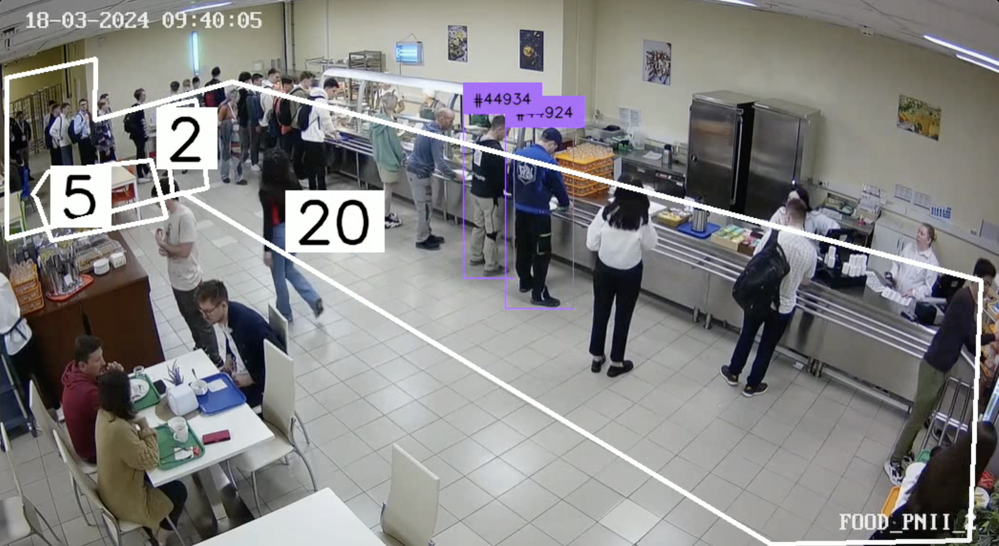

# Time Management

This project is made for managing time by letting people see how much time do they have to wait in the queue to get food in the canteen and how many tables are now free there!

## Detecting people in the queue and calculating the waiting time!

## Inastallations
1. Create a virtual environment `conda create -n timemanagement python=3.11.8` 
2. Activate it `conda activate timemanagement`
3. Install libraries `pip install supervision==0.19.0 ultralytics time numpy open-cv`
4. Run the code `Time Management.ipynb`

## Authors
1. Vladimir Kalaychidi
2. Maksim Ruchyov
3. Ilya Baigulov
